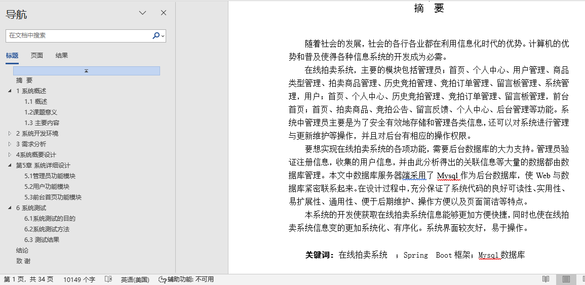
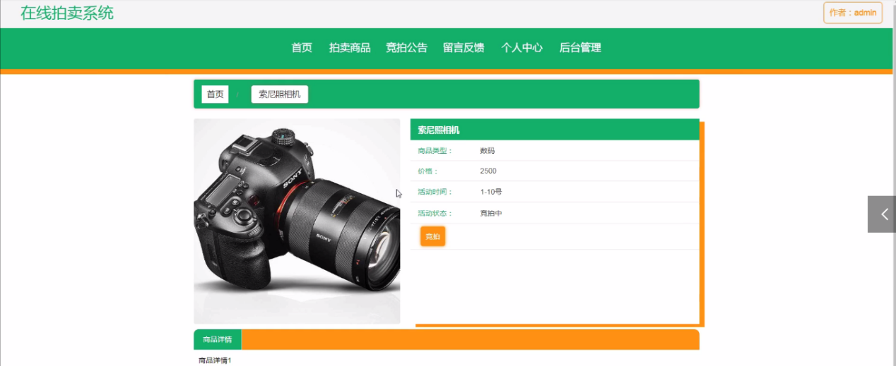
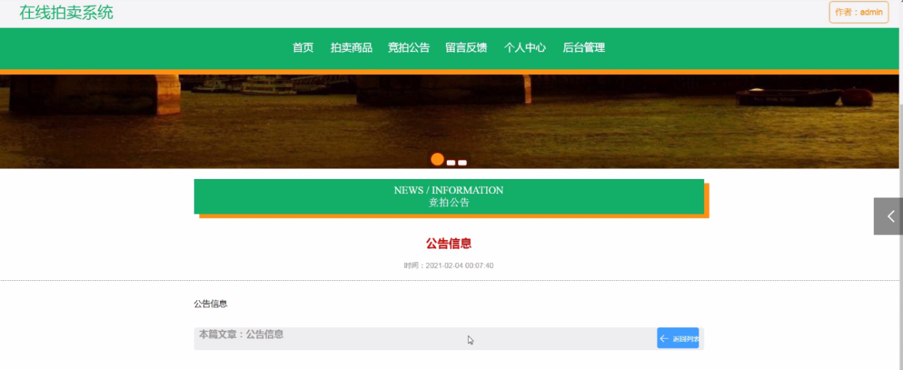
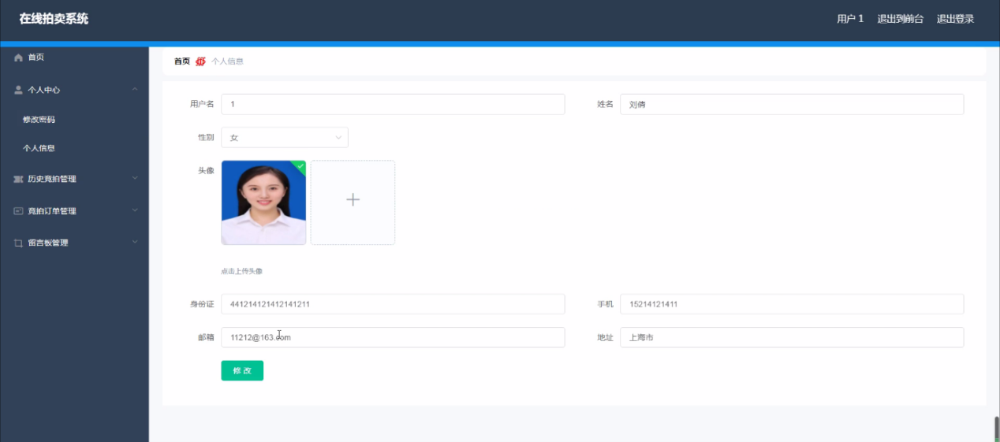
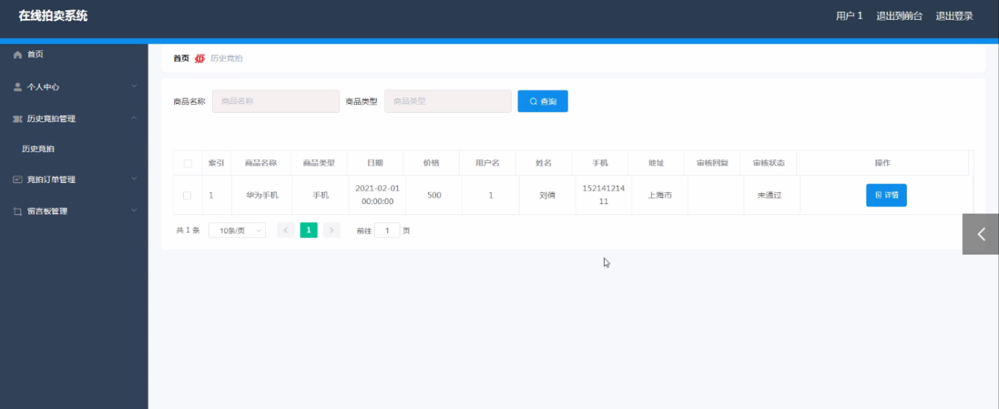
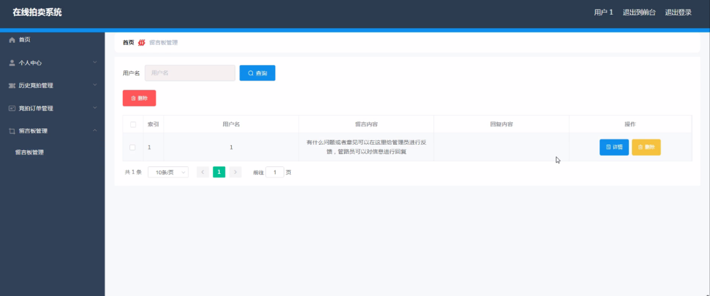
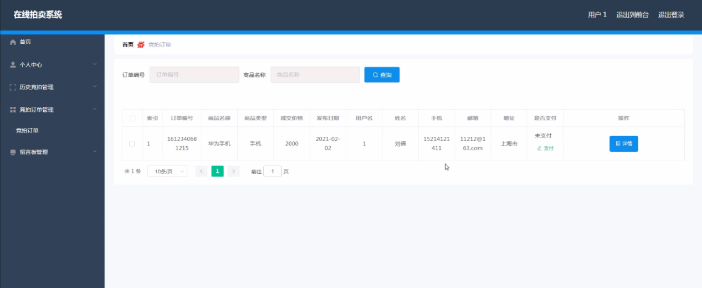

## 基于SpringBoot的在线拍卖系统(程序+报告)

- <b>完整代码获取地址：从戎源码网 ([https://armycodes.com/](https://armycodes.com/))</b>
- <b>技术探讨、资料分享，请加QQ群：692619798</b> 
- <b>作者微信：19941326836  QQ：952045282</b> 
- <b>承接计算机毕业设计、Java毕业设计、Python毕业设计、深度学习、机器学习</b>
- <b>选题+开题报告+任务书+程序定制+安装调试+论文+答辩ppt 一条龙服务</b>
- <b>所有选题地址 ([https://github.com/YuLin-Coder/AllProjectCatalog](https://github.com/YuLin-Coder/AllProjectCatalog)) </b>

## 项目介绍
基于SpringBoot的在线拍卖系统，系统包含两种角色：用户、管理员，系统分为前台和后台两大模块，主要功能如下：

前台功能

用户角色：
1. 首页：
   - 显示拍卖系统的主要信息，包括热门拍卖商品、最新竞拍公告等。
2. 拍卖商品：
   - 用户可以浏览当前正在拍卖的商品，查看商品详情，参与竞拍。
3. 竞拍公告：
   - 显示系统发布的最新竞拍公告，包括拍卖规则、竞拍时间等信息。

4. 留言反馈：
   - 用户可以提交反馈意见和建议，与管理员进行交流。

5. 个人中心：
   - 用户可以查看和编辑个人信息，管理个人账户。

后台功能

用户角色：

1. 个人中心：
   - 用户可以查看和编辑个人信息，管理个人账户。

2. 历史竞拍管理：
   - 查看用户参与过的历史竞拍记录，管理竞拍记录。

3. 竞拍订单管理：
   - 查看和管理用户的竞拍订单，处理订单状态。

4. 留言板管理：
   - 查看和管理用户提交的留言和反馈，与用户互动。

 管理员角色：

1. 个人中心：
   - 查看和编辑管理员个人信息，管理个人账户。

2. 用户管理：
   - 管理系统中的用户信息，包括用户的注册、修改、删除等操作。

3. 商品类型管理：
   - 管理拍卖商品的类型，添加、修改、删除商品分类。

4. 拍卖商品管理：
   - 管理拍卖商品的添加、编辑、删除和审核，设置拍卖商品的详细信息。

5. 历史竞拍管理：
   - 查看和管理所有用户的历史竞拍记录。

6. 竞拍订单管理：
   - 查看和管理所有用户的竞拍订单，处理订单状态。

7. 留言板管理：
   - 查看和管理所有用户的留言和反馈，与用户互动。

8. 系统管理：
   - 轮播图管理：管理系统首页轮播图，添加、编辑、删除轮播图。
   - 竞拍公告：发布和管理竞拍公告，通知用户最新的拍卖信息和规则。

## 项目技术
- 编程语言：Java
- 数据库：MySQL
- 项目管理工具：Maven
- 前端技术：HTML、CSS、JavaScript、Jquery、Vue
- 后端技术：Spring、SpringMVC、MyBatis

## 运行环境
- JDK版本：JDK1.8及以上
- 开发工具：IDEA、Ecplise、Myecplise都可以
- 数据库: MySQL5.7及以上
- Maven：maven3.0及以上
- Node：14.14.0及以上

## 运行截图

